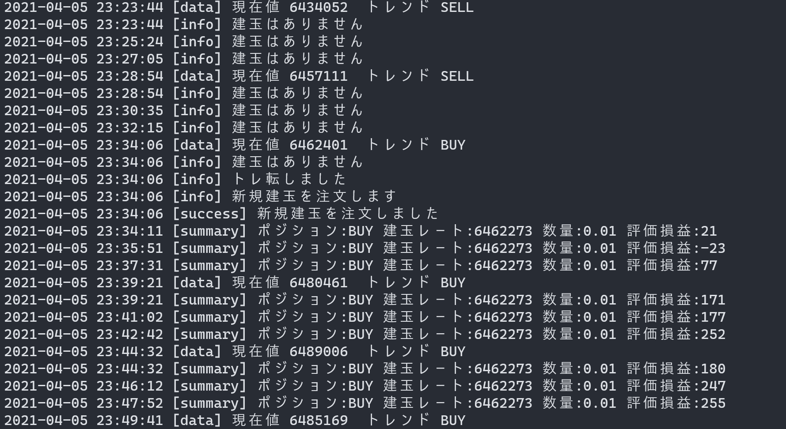

# toushi-no-mori

市場予測サイト投資の森(https://nikkeiyosoku.com/ )にあるビットコインのテクニカル分析をスクレイピングして、言ったとおりにビットコインを自動取引します。

GMOコインのリアル口座とAPIを使用します。

# DEMO

このような感じで動作します

# Features
 
何も考えずにほったらかしでビットコインの売買ができます。

# Installation
 
GMOコインの口座を開設し、十分な資金を入金したらAPIキーを取得します。

取得したAPIキーをプログラムに書き込んでおいてください。

# Usage
 
起動したら後は放置するだけです。
 
# Note
 
他人の言ったとおりに取引するだけのプログラムなので、儲かる保証は一切ありません。

私は損失を出してしまったので1ヶ月経たずに稼働を終了しました。

（含み益を出しているタイミングも結構あったので、利確や損切りのタイミング次第ではいい感じになるかもしれません。）

本体と同じディレクトリにposition.txtが存在しないとエラーになります。

# Author
 
* Miya Abe
* Waseda Univ.
